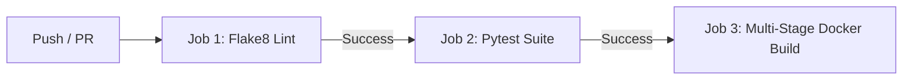

# Project 02 · Personal Expense Tracker

[](.github/workflows/pipeline.yml)

A multi-container web application built with **Flask**, **PostgreSQL**, and **Chart.js** featuring automated CI linting (`flake8`), unit tests (`pytest`), a multi-stage `Dockerfile`, and an **Ansible** deployment playbook.

---

## Architecture & Features

- **PostgreSQL Database**: Persistent storage for schema: `transactions(id, amount, category, date, note)`.
- **Flask REST Endpoints**:
  - `GET /`: Dashboard rendering transactions and category filters.
  - `POST /add`: Adds a transaction (handles both HTML form submits and JSON requests).
  - `GET /summary`: JSON aggregate metrics (`total_amount`, `transaction_count`, `by_category`).
  - `GET /chart-data`: JSON category breakdown formatted directly for Chart.js.
  - `DELETE /delete/<id>`: Delete transaction endpoint.
- **Frontend**: Glassmorphism UI with real-time Chart.js bar chart and KPI metric counters.
- **Multi-Stage Dockerfile**: Builder stage isolates compilation dependencies; slim final stage produces a lightweight image.
- **GitHub Actions CI Pipeline**: Sequential jobs: `lint` (flake8) &rarr; `test` (pytest) &rarr; `docker build`.
- **Ansible Automation**: Deploys the multi-container stack via `ansible/deploy.yml` with a single command.

---

## Directory Layout

```
expense-tracker/
├── app/
│   ├── __init__.py
│   ├── app.py                     # Flask application & route handlers
│   ├── models.py                  # PostgreSQL/SQLAlchemy schema
│   ├── templates/
│   │   └── index.html             # Dashboard template
│   └── static/
│       ├── chart.js               # Dynamic Chart.js calls (/chart-data)
│       └── style.css              # Custom styling & responsive layout
├── tests/
│   ├── __init__.py
│   └── test_routes.py             # 3 pytest unit tests using test DB fixture
├── ansible/
│   ├── deploy.yml                 # Ansible deployment playbook
│   └── hosts.ini                  # Target inventory
├── .github/
│   └── workflows/
│       └── pipeline.yml           # CI workflow (lint -> test -> build)
├── .flake8                        # Flake8 linting configuration
├── .dockerignore                  # Docker build exclusions
├── Dockerfile                     # Multi-stage container build
├── docker-compose.yml             # App + PostgreSQL container definitions
├── requirements.txt               # Application dependencies
├── .env.example                   # Configuration template
└── README.md
```

---

## Quickstart

### 1. Running Locally with Python

```bash
# 1. Install dependencies
pip install -r requirements.txt

# 2. Run lint check
flake8 app tests

# 3. Run unit test suite
pytest -v tests/

# 4. Start the Flask application
python -m app.app
```
Open [http://localhost:5000](http://localhost:5000) in your web browser.

---

### 2. Running with Docker Compose (Multi-Container)

Ensure Docker Desktop / WSL2 is running:

```bash
# Start both PostgreSQL and Flask app containers in the background
docker compose up -d --build

# View container logs
docker compose logs -f

# Stop containers
docker compose down
```
Access the application at [http://localhost:5000](http://localhost:5000).

---

### 3. Running Containerized Tests (Windows Note)

As noted in the training specification, run tests inside the container environment:

```bash
docker compose run --rm app pytest -v tests/
```

---

### 4. Running the Ansible Deployment Playbook

To deploy or redeploy the stack via Ansible:

```bash
ansible-playbook -i ansible/hosts.ini ansible/deploy.yml
```

---

## CI/CD Pipeline Flow

The GitHub Actions workflow (`.github/workflows/pipeline.yml`) executes three sequential stages:



If any step fails, subsequent jobs are blocked.

---

## Deliverables Checklist

- [x] Bar chart visualises spending by category in real time
- [x] All 3 pytest tests pass in the CI pipeline
- [x] Flake8 lint step catches and blocks any PEP 8 errors
- [x] Multi-stage image is noticeably smaller than a naive single-stage build
- [x] Ansible playbook deploys the stack from a single command
